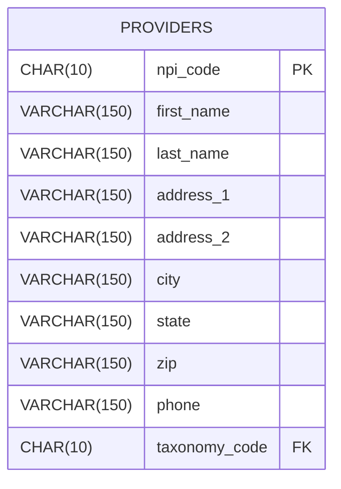

# NPI ETL Pipeline

## Overview

This python pipeline is designed to process the NPPES NPI dataset, available from [CMS](https://www.cms.gov/medicare/regulations-guidance/administrative-simplification/data-dissemination), which provides raw data for over 9.7 million NPI records (approximately 10.7 GB).

The pipeline extracts and transforms the dataset by selecting relevant provider information, performing data validation, and removing unnecessary or unusable fields. The transformed provider and taxonomy data is then loaded into a MySQL database via SQLAlchemy.

The resulting database is accessed and modified by the Express backend, which exposes the data to the React frontend through RESTful API endpoints. 

## Structure 

```text 
npi-etl/
├── data/ 
│ └── input/
│ └── output/
├── src/ 
│ ├── __init__.py 
│ ├── config.py 
│ ├── extract.py 
│ ├── transform.py 
│ └── load.py
├── main.py 
├── requirements.txt 
└── README.md 
```

 ```src/``` acts as the package containing all logic for extracting, transforming, and loading the NPI data, being imported by ```main.py```. ```data/``` is used to store all raw data, as well as the cleaned version of data upon completion.


## ETL Process

The data is processed in 3 separate ways:
### Extraction
Due to the scale of the information, loading the raw data directly into memory is infeasible; instead, ```extract.py``` returns the iterator type ```TextFileReader``` from ```pandas.io.parsers```, turning the file into a data frame of limited chunks whenever called. This means ```extract.py``` only needs to be called once. Additionally, the file name to be written to (either given by .env or args) is removed, if present (this also only needs to occur once).

### Transform
```transform.py``` is given small sections of the NPI data in a data frame, and proceeds to drop duplicates, missing NPI numbers (which are used as PKs in the database, so must exist AND be unique), and fill all empty fields.

### Load
SQLAlchemy is responsible for the database connection through an engine, initially created during ```main.py```. At this point, both ```to_csv()``` and ```to_sql()``` store the transformed data respectively, before returning.


## Database

Database access is handled via SQLAlchemy, which connects to a database with a provider table. The general provider diagram can be seen below:



## Usage

All dependencies can be installed from ```requirements.txt```. As ```main.py``` acts as the entry point to the pipeline, this can be called from the terminal as ```python3 main.py [input] [output]```, where both optional args can be defined in the .env, or given upon execution. Python 3.14 is required.

